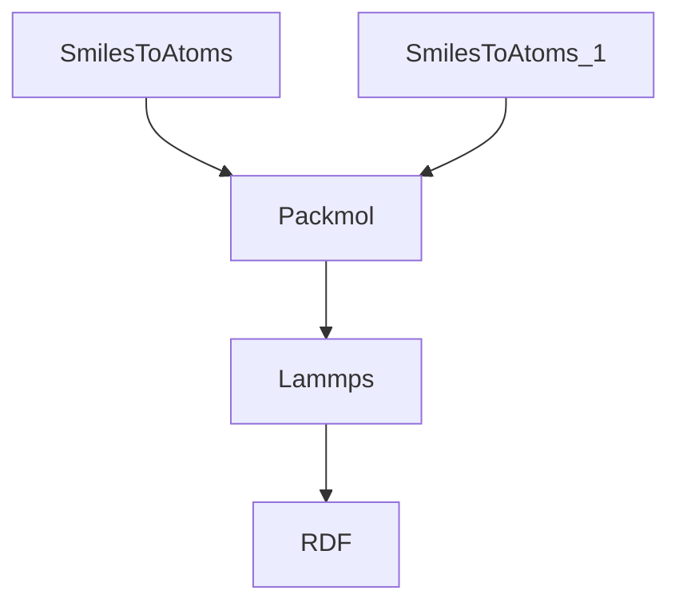
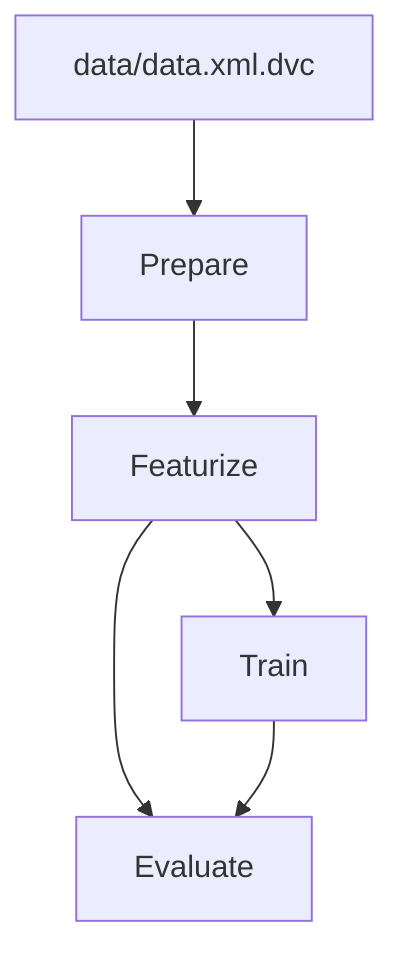

# Data as Code Artifacts

These files are anonym versions of the working examples from the paper.

## MD Simulation
The input file `molecular_dynamics.py` contains the adapted script to create the results from the paper. 
In addition to the package1, our pre-existing package for the study of machine learned interatomic potentials is used in combination with the new node to showcase the easy interoperability between packages using DaC (package4).



## Random Forest Classifier
The adapted example from https://github.com/iterative/example-get-started can be found in the directory `dvc-example/`.
The source code for the individual nodes and the workflow file are seperated.
The workflow can be found in the `main.py`.



## Structural Database Repository

This is an exemplary input script for creating a geometry optimized BMIM-BF4 system, which is directly available from the GitHub repository.
It uses package4 from above which is built using package1.

```python
import package4

project = package4.Project(automatic_node_names=True)

with project.group(name="BMIM_BF4"):
    cation = package4.configuration_generation.SmilesToAtoms("CCCCN1C=C[N+](=C1)C")
    anion = package4.configuration_generation.SmilesToAtoms("[B-](F)(F)(F)F")
    
    single_structure = package4.configuration_generation.Packmol(
        data=[cation.atoms, anion.atoms],
        count=[1, 1],
        density=1210,
    )

    structure = package4.configuration_generation.Packmol(
        data=[single_structure.atoms],
        count=[10],
        density=1210,
    )
    
    cp2k = package4.calculators.CP2KSinglePoint(
        data=structure,
        cp2k_files=["GTH_BASIS_SETS", "GTH_POTENTIALS", "dftd3.dat"],
        cp2k_shell=cp2k_shell,
    )

    geopt = package4.calculators.ASEGeoOpt(
        model=cp2k,
        data=structure.atoms,
        optimizer="BFGS",
        run_kwargs={"fmax": 0.1},
        name="x10",
    )

project.build()
```